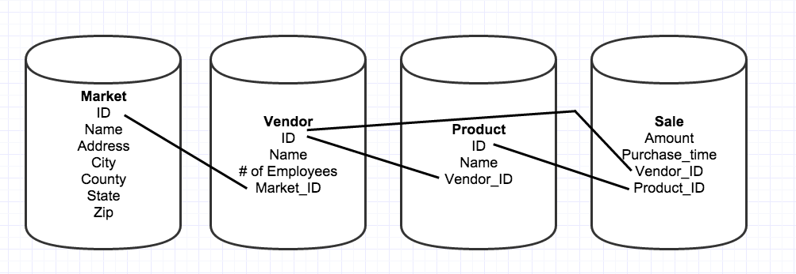

Trello Tasks: https://trello.com/b/bYnMG1hZ/rails-farmar

# FarMar Rails
Build a database backend application to view, create, and manage farmers markets as well as their vendors, products, and sales.
In this implementation we'll be seeding with static data, and also building a tool to allow markets and/or vendors to sign up and add their own data.

As you are using ActiveRecord to access the database compare the methods that are given to those you had to create in the CSV implementation of FarMar.

This project is meant to be exploratory. Take time to try to dive into each piece of Rails (routes, controllers, models, views). This project is built so that you and your partner can create the waves yourself based on the dependencies of the requirements given.

## Best Practices
- Use git relentlessly
- Use correct indentation
- Pair program on difficult problems or to share learning experiences.

## Baseline
Before you start writing _any_ code:

- Review the requirements with your partner
- Create a Trello board
  - Organize your tasks/stories
  - Discuss who will do which tasks and when you will target completion
    - What things should be done together as pairs vs individually?
  - Organize your tasks/stories into iterations (a.k.a waves)
- Create a data diagram based on the original data [specification](https://github.com/Ada-C4/FarMar)

Once the above is complete, this project:

- requires a shared repo with your partner as a collaborator
- will need to be isolated into a gemset called 'FarMarRails'
  - create the necessary files for RVM to recognize a gemset
- requires you to create a Rails application
  - conform to Rails conventions on naming and inflection
  - by using `rails new .` you will create a new rails app _inside_ of the fork folder instead of creating a _new_ folder for your rails app

**Your team shall submit a pull request with a link to your Trello board once you are done with the baseline which shall be merged before moving onto implementing the requirements**

## Requirements
However far you and your partner get, the application should have, at a minimum, the following features:
- Seeded data in your database from the original CSV files
- Multiple Active Record models
- RESTful routing
- Deployed application to Heroku
- A "look and feel" that will make you and your partner happy!

## User Stories

### Overall
- As a user, when I visit "/", I can choose whether I want to act as a Market or a Vendor
- As a user, I can view all Markets
- As a user, I can view a specific Market, I should see it's attributes as well as a list of it's vendors

### Market
- As a market, I can create or edit a Market
- As a market, I can create, edit, or delete any Vendor

### Vendor
- As a vendor, I can create, edit, or delete my Products
- As a vendor, I can create a Sale for one of my Products
- As a vendor, I can see a list of my Sales
- As a vendor, I can see a total of all of my Sales
- As a vendor, I can see a list of my Sales for the current month
- As a vendor, I can see a total of my Sales for the current month
